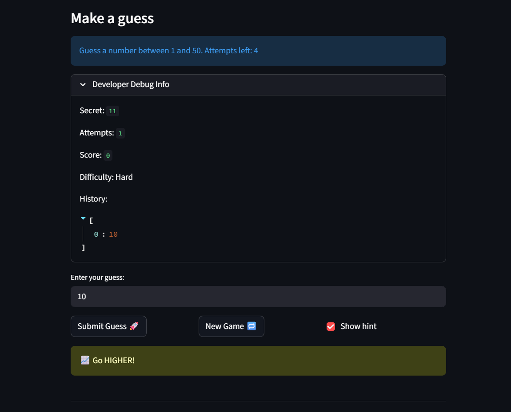

# 🎮 Game Glitch Investigator: The Impossible Guesser

## 🚨 The Situation

You asked an AI to build a simple "Number Guessing Game" using Streamlit.
It wrote the code, ran away, and now the game is unplayable. 

- You can't win.
- The hints lie to you.
- The secret number seems to have commitment issues.

## 🛠️ Setup

1. Install dependencies: `pip install -r requirements.txt`
2. Run the broken app: `python -m streamlit run app.py`

## 🕵️‍♂️ Your Mission

1. **Play the game.** Open the "Developer Debug Info" tab in the app to see the secret number. Try to win.
2. **Find the State Bug.** Why does the secret number change every time you click "Submit"? Ask ChatGPT: *"How do I keep a variable from resetting in Streamlit when I click a button?"*
3. **Fix the Logic.** The hints ("Higher/Lower") are wrong. Fix them.
4. **Refactor & Test.** - Move the logic into `logic_utils.py`.
   - Run `pytest` in your terminal.
   - Keep fixing until all tests pass!

## 📝 Document Your Experience

- [ ] Describe the game's purpose.
The games purpose is for user's to try guessing a random secret number that is within that game's difficulty level input range. You can play several games by clicking the new game button. You can play the rounds in different difficulty levels such as hard, normal, and easy. 

- [ ] Detail which bugs you found.
1) The high and low updates were incorrect
2) The displayed input ranges for each difficulty level were incorrect
3) The game didn't allow you to start a new game. 
4) Score didn't reset to 0 each new game
5) Didn't account for inputs that were out of the difficulty's level input range
6) The secret number wasn't within the input range for some difficulty levels like hard and easy.
7) If user changes difficulty mode mid game, then the next chosen difficulty mode continues old mode's game and doesn't start a new game.For example, if a user plays normal mode till attempt 7 then switiching to hard mode it continue that game and attempt become -2(since max attempts for hard level is 5).
8) Final score wasn't updated with the debug info score.

- [ ] Explain what fixes you applied.
1) I fixed the logic in app.py: If guess is too high, then say go lower instead of go higher. And if guess is too low, then say go higher instead of go lower. 
2) I changed the input ranges for the difficulty levels to not always be 1-100, instead be dependent on the difficulty level's high and low variables. 
3) Initially winning or losing meant that you can't play the game anymore. I changed that, so you can still play new games. 
4) I made the score reset to 0 everytime it rerun, so the new game will start with 0 score and not previous game's score
5) Made an if statement to check whether user inputs are within that difficulty level's input range. If not, then output an error message saying its out of range. 
6) Fixed so the secret number will call random number within that corresponding difficulty level's range, instead of always being within 1-100 range. 
7) Disabled the selection of difficulty level, if user is currently playing (attempt >= 1). While playing, user can only change difficulty level if user clicks a new game. 
8) Using streamlit's rerun and correct order of updates I fixed Final score to be same as score in debug info. 

## 📸 Demo

- [ ] [Insert a screenshot of your fixed, winning game here]

## 🚀 Stretch Features

- [ ] [If you choose to complete Challenge 4, insert a screenshot of your Enhanced Game UI here]
